# JankenCamera: Bare-metal exposure fusion pipeline on Raspberry Pi

**Justin Wu** (justinyw)

---

## Summary

I built a bare-metal exposure fusion pipeline on a Raspberry Pi Zero W and IMX219 camera module. I extracted RAW Bayer frames through a FrankenCamera-style API, ran them through a GPU-optimized image processing pipeline to get linear RGB images, and performed Mertens exposure fusion algorithm to get the final fused image.

### Background
The Raspberry Pi Zero W is a relatively weak computer, with only a 1 GHz CPU, twelve 400Hz GPU cores, and 500MB of RAM. Given this resource-contrained device, I wanted to see how fast I can make a simple end-to-end exposure fusion pipeline, consisting of these components:

1. Camera API (capturing sensor readings with parameters like exposure, gain, and timing)
2. Black level subtraction
3. White balance
4. Demosaic
5. Mertens exposure fusion

The crux of the project was writing Raspberry Pi GPU kernels to optimize the image processing algorithms, though a non-insignificant amount of engineering work also went into designing the frame capture system and writing device drivers.

---

## Approach

### Camera System
I first set up the system to control camera parameters and capture frames. Since the IMX219 is constantly streaming sensor data, I implemented a ring buffer with pointers to the last-completed and currently-writing frames. These are updated in an interrupt routine triggered every time the camera finishes writing a frame. Finally, I allocated separate buffers to store captured Bayers for later processing.

Less interesting engineering work: drivers for the camera itself and MIPI CSI-2 interface.

### Camera API
To configure when and how to capture images, I used an API inspired by FrankenCamera. It consists of these components:

**Config**
- Width (in pixels)
- Height (in pixels)
- Stride (bytes per row)
- Format (10-bit or 8-bit per pixel)
- Bayer format (RGGB by default)

**Shot**
- Exposure (in microseconds)
- Gain (analog × digital gain in multiplier amount)
- Analog gain (in multiplier amount)
- Digital gain (in multiplier amount)
- Timestamp (from system clock, in microseconds)
- Error (difference between actual and intended capture time, in microseconds)
- Delay (time after last frame if part of a series of shots, in microseconds)

**Frame**
- Buffer (pointer to RAW Bayer output from camera stream)
- Size (buffer size in bytes)
- Sequence number (global counter of images taken)
- Config (camera config object associated with this frame)
- Shot (shot object associated with this frame)

I followed the FrankenCamera philosphy of best-effort, since certain attributes are impossible to get exactly right (especially the timestamp, which depends on when the camera finishes writing a frame).

### Kernel Optimization
The Raspberry Pi Zero W comes with a VideoCore IV GPU:
- 12 Quad Processing Units (QPUs): each acts as a 16-wide SIMD processor
- Vertex and Pixel Memory (VPM): 4KB of memory shared between all 12 QPU cores (64 rows of 16 four-byte words)
- Direct Memory Access (DMA) module: synchronously move contiguous memory between the Pi's RAM and VPM (shared for all cores)
- 2 Texture Memory Units (TMUs): asynchronously performs gather operations from RAM to VPM

Since we only have 16-wide vector operations, very limited memory, and no scatter (I can only write to contiguous memory intervals), it took some thinking to come up efficient kernels, even if the algorithm seems trivially parallelizable. It didn't help that the primary interface was an assembly-like langauge at the register level, which made it very hard to debug and handle divergence between SIMD lanes!

I ended up primarily iterating over the output (since I'm constrained by writing to contiguous memory), and using the gather operation to retrieve the data I need. Also, I tried designing kernels with as little conditionals as possible, so each core would be essentially doing the same thing (making work assignment between cores easier, since I could just stride by the # of cores).
 In cases where SIMD divergence was necessary (e.g. demosaicing, where neighboring pixels have different formulas), I masked off irrelevant lanes and merged them after calculating each part independently.

To find bottlenecks, I profiled each component of the pipeline and optimized them the best I could without sacrificing visual fidelity.

---

## Evaluation and Results

I had two main parts to my evaluation:

**Correctness**: Does the Pi output what it's supposed to? To evaluate this, I implemented the exact same algorithm on my Mac, and used my Mac outputs as a ground truth baseline to compare my Pi outputs (using PSNR, SSIM).

**Efficiency**: How fast is the pipeline running? To evaluate this, I documented my progress and tracked the speedup as I made more and more optimizations.

### Quantitative Analysis

Here is a table of all of my optimizations:

| Platform / Optimization                                     | Black-level subtraction (ms) | White balance (ms) | Demosaic (ms) | Total up to demosaic (ms) | Mertens Exposure Fusion (ms) | Total (ms) |
| ----------------------------------------------------------- | ---------------------------: | -----------------: | ------------: | ------------------------: | ---------------------------: | ---------: |
| Naive              |                       31.620 |            154.378 |        90.825 |                   276.823 |                    12584.970 |  12861.793 |
| Gaussian convolution GPU kernel                             |                       31.617 |            153.370 |        90.399 |                   275.386 |                     6058.578 |   6333.964 |
| Unified memory                                      |                       32.511 |            153.388 |        90.369 |                   276.268 |                     3443.937 |   3720.205 |
| Add/sub/mul-add/copy/scalar kernels                         |                       32.522 |            159.801 |        90.400 |                   282.723 |                     2786.567 |   3069.290 |
| Weight map kernels                                          |                       31.624 |            154.354 |        91.821 |                   277.799 |                     1427.115 |   1704.914 |
| White balance/Bayer kernels                                 |                            Fused with white balace → |             12.138 |        24.042 |                    36.180 |                     1408.963 |   1445.143 |

And here is a table of the Mertens-specific optimizations and their impact on the exposure fusion algorithm:
| Platform / Optimization                                     | Initial norm (ms) | Compute weight maps (ms) | Norm weight maps (ms) | Build pyramids (ms) | Blend (ms) | Collapse (ms) | Scale back (ms) | Total (ms) |
| ----------------------------------------------------------- | ----------------: | -----------------------: | --------------------: | ------------------: | ---------: | ------------: | --------------: | -----------------: |
| Naive              |           176.254 |                 1700.805 |                93.545 |            8145.115 |   1075.542 |      1200.850 |         100.438 |          12492.549 |
| Gaussian convolution GPU kernel                             |           176.312 |                 1700.482 |                93.586 |            2497.243 |   1077.284 |       394.330 |         100.435 |           6039.672 |
| Unified memory                                      |           176.235 |                 1419.144 |                93.299 |             996.586 |    467.863 |       171.623 |         100.464 |           3425.214 |
| Add/sub/mul-add/copy/scalar kernels                         |            56.100 |                 1419.427 |                93.256 |             857.023 |    146.747 |       143.861 |          18.666 |           2735.080 |
| Weight map kernels                                          |            56.135 |                   56.479 |                93.306 |             855.839 |    146.700 |       143.352 |          18.663 |           1370.474 |

And here is the PSNR/SSIM comparison against the Mac baseline for the final output:
| Image   | PSNR (dB) |   SSIM |
| ------- | --------: | -----: |
| Frame 0 |     50.68 | 0.9937 |
| Frame 1 |     50.54 | 0.9971 |
| Frame 2 |     52.11 | 0.9982 |
| Mertens |     50.30 | 0.9963 |

#### Main takeaways
- The slowest part of the pipeline is calculating Laplacian and Gaussian pyramids ("build pyramids" section of the Mertens table), so turning that into a GPU kernel made that piece of the pipeline ~3.2x faster
    - However, we didn't see the theoretical 12x speedup because the program was memory-bound
- The Raspberry Pi Zero W uses a unified memory model, so the GPU and CPU actually see the same RAM. Therefore, I didn't have to copy memory between the CPU and GPU, which made the entire pipeline run another ~2 times faster (since the pipeline was previously very memory-bound)
    - With this, building pyramids went from ~8 seconds to ~1 second, an 8x speedup! (I'm speculating the rest is from memory overhead of waiting for TMU gathers)
    - Also sped up many other parts of the pipeline where I was needlessly copying data
- Fusing kernels to increase arithmetic intensity
    - For example, I used to have three different functions for computing the saturation, exposedness, and contrast parts of the weight maps, but I fused them into two kernels (one performing saturation, exposedness, and turning the image into grayscale, the other performing a Laplacian convolution for contrast) so that I only have to load/store the image 4 times instead of 8 previously
    - I also fused black-level subtraction and white balancing into a single kernel for the same reason
- Overall, adherence to the baseline was very good throughout the entire process
    - PSNR never dipped below 50 and SSIM never dipped below 0.99, meaning that the images were always almost identical to the baseline
- (Not shown in the tables) I tried using 16.16 fixed-point integers instead of floats, but ran into accuracy issues (not enough bits to store intermediate sums), and it didn't have a noticable impact on performance in cases where precision wasn't an issue
- (Also not shown in the tables)  I tried different dynamic memory allocation schemes (buddy/slab allocator vs. bump allocator) to manage memory, but it also didn't end up making a huge difference
    - The bump allocator was slightly faster since I could mass allocate/free with a single pointer update, but the difference was insignificant compared to the actual algorithm runtimes (since I'd only allocate like once or a few times per algorithm) so I didn't include them in the tables

### Qualitative Analysis

Mertens Exposure fusion is a little annoying in the sense that you need pixel-perfect alignment and cleanly-exposed images for it to perform well. Since my camera module isn't the greatest (and I had no case to keep it still), setting up a good shot was quite challenging.

Here are two cases where the fusion turned out pretty well, and one case where it failed:

<table>
  <tr>
    <th>Frame 0</th>
    <th>Frame 1</th>
    <th>Frame 2</th>
    <th>Mertens Output</th>
  </tr>
  <tr>
    <td>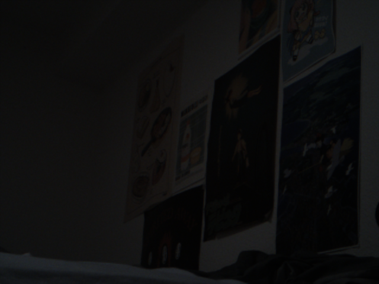</td>
    <td>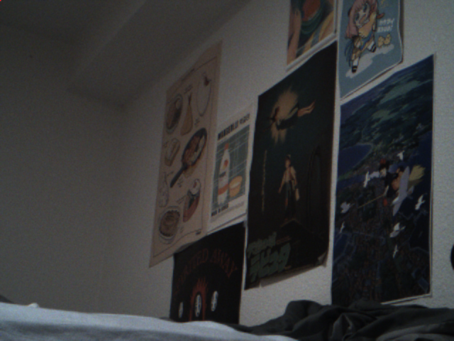</td>
    <td>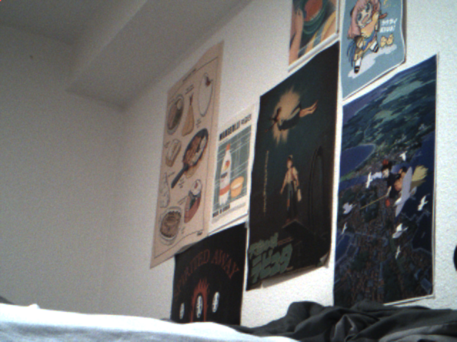</td>
    <td>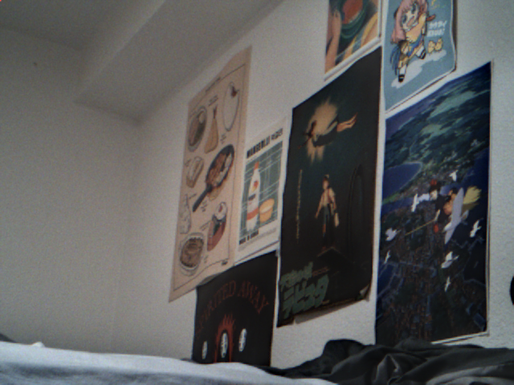</td>
  </tr>
  <tr>
    <td colspan="4" align="center">
      <em>
        The fused image took the blue mattress in the bottom left from the middle exposure,
        and the background from the higher exposure.
      </em>
    </td>
  </tr>
  <tr>
    <td>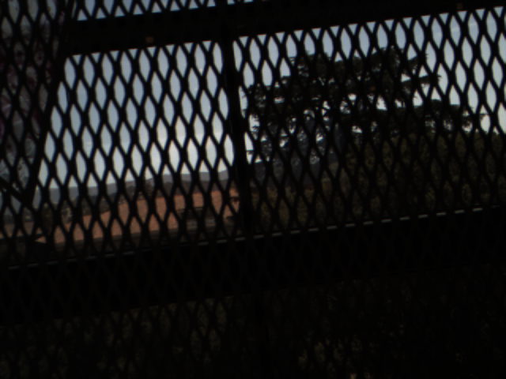</td>
    <td>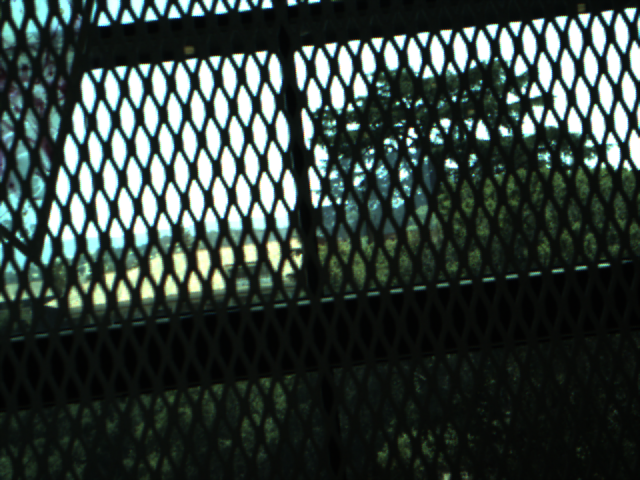</td>
    <td>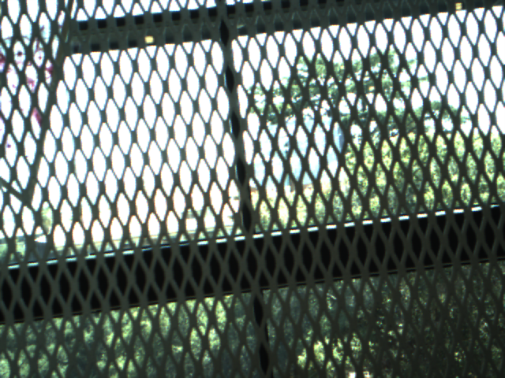</td>
    <td>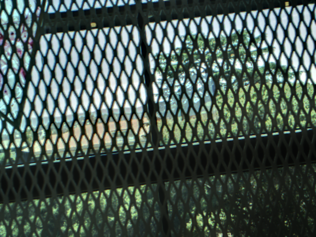</td>
  </tr>
  <tr>
    <td colspan="4" align="center">
      <em>
        The fused image successfully captures attributes from the foreground fence
        and the background through the window.
      </em>
    </td>
  </tr>
  <tr>
    <td>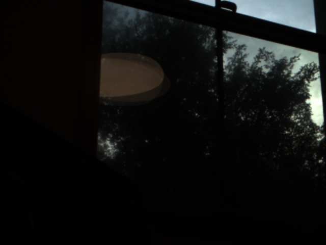</td>
    <td>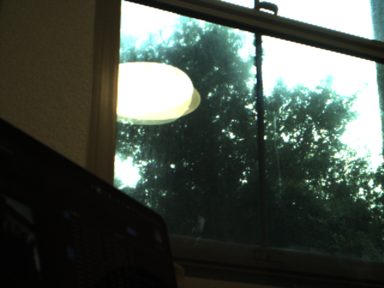</td>
    <td>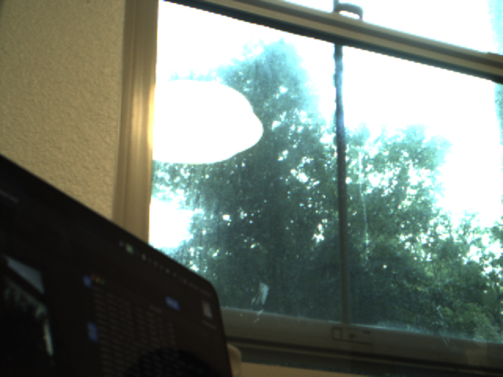</td>
    <td>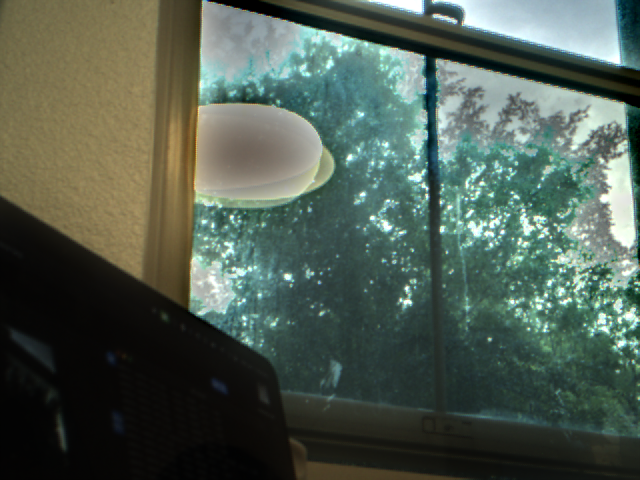</td>
  </tr>
  <tr>
    <td colspan="4" align="center">
      <em>
        At higher exposures, lights bleed outward and cover more area than
        lower exposures, causing misalignment between the images (e.g., the
        reflected light source appears larger in the higher-exposure frames,
        and the trees aren't blended well).
      </em>
    </td>
  </tr>
</table>

### Conclusion

The algorithm is very performant and accurate, and does well when given well-aligned, clean input images. However, capturing good input images, especially with this specific camera module, is quite difficult and requires lots of tuning.

---

### References
- FrankenCamera: https://graphics.stanford.edu/papers/fcam/
- Mertens Exposure Fusion: https://web.stanford.edu/class/cs231m/project-1/exposure-fusion.pdf
- IMX219 Data Sheet: https://www.opensourceinstruments.com/Electronics/Data/IMX219PQ.pdf
- Raspberry Pi VideoCore IV documentation: https://docs.broadcom.com/doc/12358545
- Circle libcamera implementation: https://github.com/rsta2/libcamera
